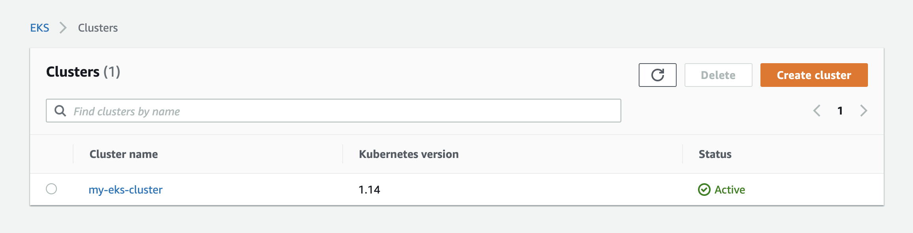
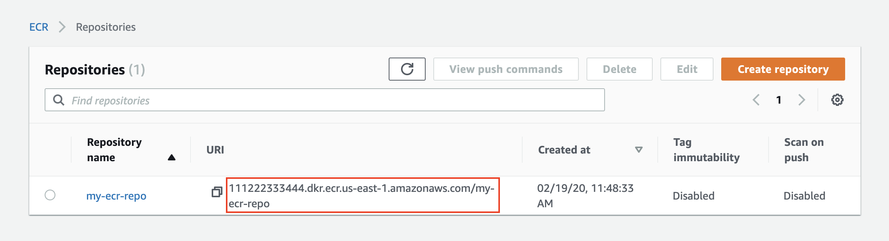

# Working with Amazon Web Services

You can install the WSO2 API Operator in AWS EKS cluster.

## Configure Kubectl with the EKS cluster

Use the AWS CLI command: [update-kubeconfig](https://docs.aws.amazon.com/cli/latest/reference/eks/update-kubeconfig.html)
to configure the `kubectl` so that you can connect to an Amazon EKS cluster. 

```sh
>> aws eks --region <REGION> update-kubeconfig --name <CLUSTER_NAME>
```

For the following case it is `my-esk-cluster` and configure `kubectl` as follows.



```sh
>> aws eks --region us-east-1 update-kubeconfig --name my-eks-cluster
```

Test your configuration.
```sh
>> kubectl get svc

Output:
NAME         TYPE        CLUSTER-IP   EXTERNAL-IP   PORT(S)   AGE
kubernetes   ClusterIP   10.100.0.1   <none>        443/TCP   1m
```

Verify that you have running Node Groups with following command. Otherwise, launch a
[Managed Node Group](https://docs.aws.amazon.com/eks/latest/userguide/managed-node-groups.html).
```sh
>> kubectl get nodes
```

## Create an Amazon ECR repository.

You can use Amazon ECR as the registry or other registry type. Following [Install API Operator](#install-api-operator)
section describes using an Amazon ECR registry type. It also works with other registry types.



## Install API Operator

- Set the operator version as `v1.2.2` by executing following in a terminal.
    ```sh
    >> export WSO2_API_OPERATOR_VERSION=v1.2.2
    ```
- Execute the following command to install API Operator interactively and configure the repository to push the
  Microgateway image.
- Select "Amazon ECR" as the repository type.
- Enter the repository uri which is highlighted in the above image.
- Enter the file path for aws credentials file. Default is `<USER_HOME>/.aws/credentials`.
- Confirm the configuration are correct with entering "Y"

```sh
>> apictl install api-operator
Choose repository type:
1: Docker Hub
2: Amazon ECR
3: GCR
4: HTTP Private Registry
5: HTTPS Private Registry
6: Quay.io
Choose a number: 1: 2
Enter repository name (<aws_account_id.dkr.ecr.region.amazonaws.com>/repository): 610968236798.dkr.ecr.us-east-2.amazonaws.com/my-ecr-repo
Amazon credential file: /Users/wso2/.aws/credentials:

Repository     : 111222333444.dkr.ecr.us-east-1.amazonaws.com/my-ecr-repo
Credential File: /Users/wso2/.aws/credentials
Confirm configurations: Y:
```
```sh
Output:
[Installing OLM]
customresourcedefinition.apiextensions.k8s.io/clusterserviceversions.operators.coreos.com created
...

[Installing API Operator]
subscription.operators.coreos.com/my-api-operator created
[Setting configs]
namespace/wso2-system created
...

[Setting to K8s Mode]
```

## Try out
Try out [sample scenarios](../../GettingStarted/quick-start-guide.md#sample-scenarios) in the quick start guide.

## Clean up

- Delete the AWS ECR repository.
- Uninstall the operator

```sh
>> apictl uninstall api-operator

Uninstall "api-operator" and all related resources: APIs, Securities, Rate Limitings and Target Endpoints
[WARNING] Remove the namespace: wso2-system
Are you sure: N: Y
```

```sh
Output:
Deleting kubernetes resources for API Operator
Removing namespace: wso2-system
This operation will take some minutes...
namespace "wso2-system" deleted
customresourcedefinition.apiextensions.k8s.io "apis.wso2.com" deleted
customresourcedefinition.apiextensions.k8s.io "securities.wso2.com" deleted
customresourcedefinition.apiextensions.k8s.io "ratelimitings.wso2.com" deleted
customresourcedefinition.apiextensions.k8s.io "targetendpoints.wso2.com" deleted
```
