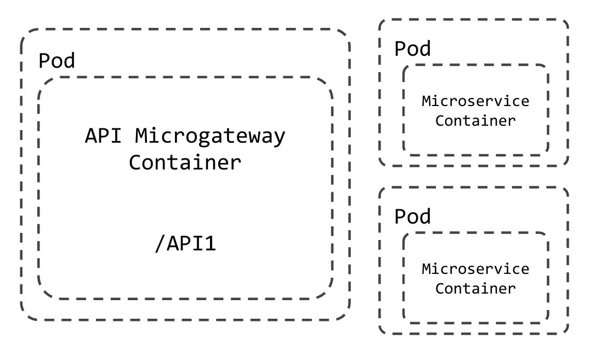
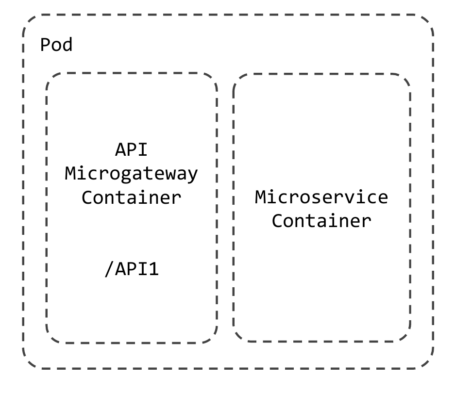
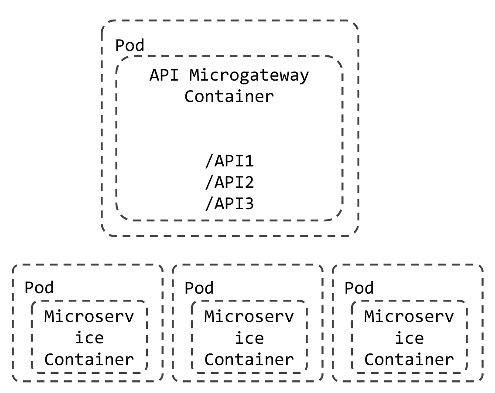

### Deployment Modes

Currently, API Operator supports 3 deployment patterns.

- Private jet mode
- Side car mode
- Shared mode

All these deployment modes can be tested out using with the help of the scenarios available in the API Operator.

##### Private jet Mode

- In private jet mode, backend and the managed API will be deployed in two different pods.
- First, you have to deploy a target endpoint resource containing the information of the backend service
  and refer the backend in the swagger definition.

You have to set the mode in the swagger file.

    `x-wso2-mode: privateJet`
    
- The scenario related to this mode can be found [here](../../scenarios/scenario-7/README.md).

##### Side car Mode

- In sidecar mode, backend and the managed API will be deployed in the same pod.

- First, deploy the target endpoint resource containing information about backend service and refer the backend
in the swagger definition.

You have to set the mode in the swagger file.

    `x-wso2-mode: sidecar`
    
- The scenario related to this mode can be found [here](../../scenarios/scenario-8/README.md).

##### Shared Mode

- In shared mode, multiple API definitions are exposed through a single Microgateway.

- Here, you can initialize several API projects and add a new API including all those API projects. 
This will expose those APIs via the same Microgateway using their respective base paths set using `x-wso2-basePath`.

- The scenario related to this mode can be found [here](../../scenarios/scenario-16/README.md).

  

