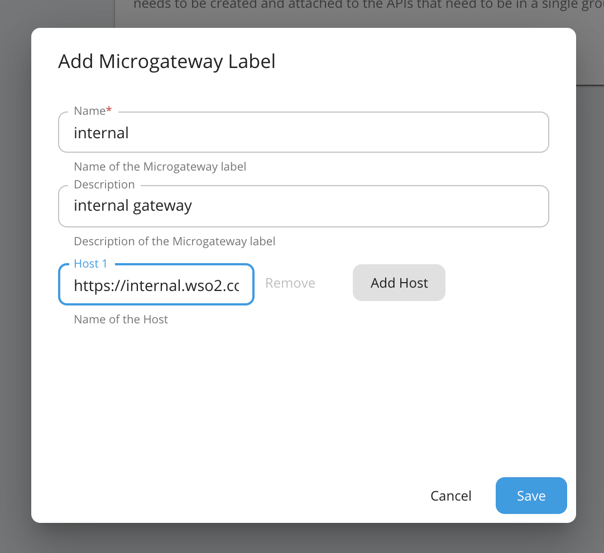
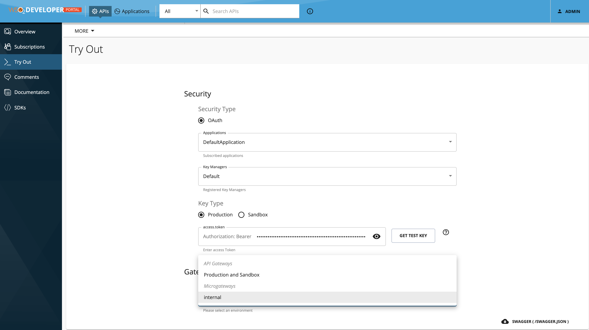
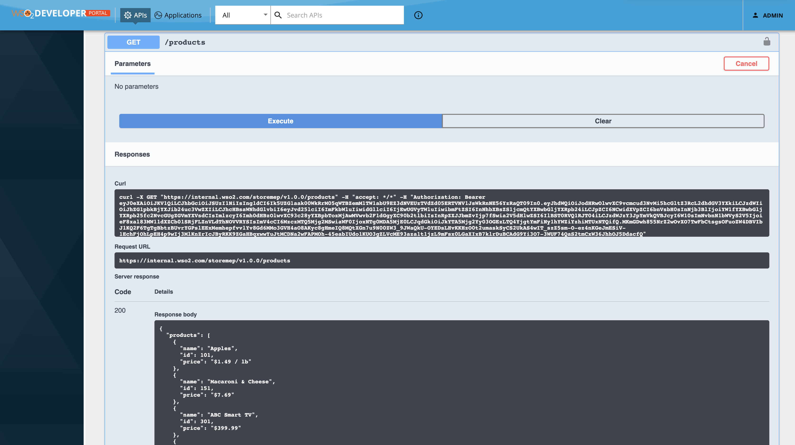

# API Gateway in Istio as a Service

In this scenario, we have a microservice deployed in Istio. Also we will deploy the API microgateway in Istio as a normal service.

This works in Istio permissive mode and Strict MTLS mode.


### Installation Prerequisites

- [Kubectl](https://kubernetes.io/docs/tasks/tools/install-kubectl/)

- [Kubernetes v1.12 or above](https://Kubernetes.io/docs/setup/) <br>

    - Minimum CPU : 8vCPU
    - Minimum Memory : 12GB
    
- [Istio v1.3.x or above](https://istio.io/docs/setup/platform-setup/)

- An account in DockerHub or private docker registry

- Download [k8s-api-operator-1.2.0-beta.zip](https://github.com/wso2/k8s-api-operator/releases/download/v1.2.0-beta/k8s-api-operator-1.2.0-beta.zip) and extract the zip

    1. This zip contains the artifacts that required to deploy in Kubernetes.
    2. Extract k8s-api-operator-1.2.0-beta.zip
    
    ```sh
    >> cd k8s-api-operator-1.2.0-beta/scenarios/scenario-13/S03-API_Gateway_In_Istio_As_A_Service
    ```
 
    **_Note:_** You need to run all commands from within the ```S03-API_Gateway_In_Istio_As_A_Service``` directory and
    consider `k8s-api-operator-1.2.0-beta` as the `<K8S_API_OPERATOR_HOME>`.

<br />

#### Step 1: Configure API Controller

- Download API controller v3.2.0 or the latest v3.2.x from the [API Manager Tooling web site](https://wso2.com/api-management/tooling/)
    
    - Under Dev-Ops Tooling section, you can download the tool based on your operating system.

- Extract the API controller distribution and navigate inside the extracted folder using the command-line tool

- Add the location of the extracted folder to your system's `$PATH` variable to be able to access the executable from anywhere.

- You can find available operations using the below command.
    
  ```sh
  >> apictl --help
  ```
<br />

#### Step 2: Install API Operator

- Execute the following command to install API Operator interactively and configure repository to push the microgateway image.
- Select "Docker Hub" as the repository type.
- Enter repository name of your Docker Hub account (usually it is the username as well).
- Enter username and the password
- Confirm configuration are correct with entering "Y"

    ```sh
    >> apictl install api-operator
    Choose registry type:
    1: Docker Hub
    2: Amazon ECR
    3: GCR
    4: HTTP Private Registry
    5: HTTPS Private Registry
    6: Quay.io
    Choose a number: 1: 1
    Enter repository name: jennifer
    Enter username: jennifer
    Enter password: *******
    
    Repository: jennifer
    Username  : jennifer
    Confirm configurations: Y: Y
    ```

    Output:
    ```sh
    customresourcedefinition.apiextensions.k8s.io/apis.wso2.com created
    customresourcedefinition.apiextensions.k8s.io/ratelimitings.wso2.com created
    ...
    
    namespace/wso2-system created
    deployment.apps/api-operator created
    ...
    
    [Setting to K8s Mode]
    ```
<br />

#### Step 3: Configure API Operator

Edit the config file `<K8S_API_OPERATOR_HOME>/api-operator/controller-artifacts/controller_conf.yaml` to make
following changes.

- Change the operator mode to `istio`.
    ```yaml
    operatorMode: "istio"
    ```

- Customize the istio-configs.
    ```yaml
    apiVersion: v1
    kind: ConfigMap
    metadata:
      name: istio-configs
      namespace: wso2-system
    data:
      #Gateway name
      gatewayName: "wso2-gateway"
      #Gateway host
      host: "internal.wso2.com"
      #CORS policy
      corsPolicy: |
        allowOrigins:
          - exact: https://localhost:9443
        allowMethods:
          - GET
          - POST
          - PUT
          - DELETE
        allowCredentials: true
        allowHeaders:
          - authorization
          - Access-Control-Allow-Origin
          - Content-Type
          - SOAPAction
          - apikey
          - Authorization
    ```

- Apply changes.
    ```sh
    >> apictl apply -f <K8S_API_OPERATOR_HOME>/api-operator/controller-artifacts/controller_conf.yaml
    ```
<br />

#### Step 4: Setting up TLS for Istio Ingress Gateway

This guide is based on https://istio.io/docs/tasks/traffic-management/ingress/secure-ingress-mount/

- Create a root certificate and private key to sign the certificates for your services.
    ```sh
    >> openssl req -x509 -sha256 -nodes -days 365 -newkey rsa:2048 \
            -subj '/O=wso2 Inc./CN=wso2.com' \
            -keyout wso2.com.key \
            -out wso2.com.crt
    ```

- Create a certificate and a private key.
    ```sh
    >> openssl req -out internal.wso2.com.csr -newkey rsa:2048 -nodes \
            -keyout internal.wso2.com.key \
            -subj "/CN=internal.wso2.com/O=httpbin organization"
    >> openssl x509 -req -days 365 -set_serial 0 -in internal.wso2.com.csr \
            -CAkey wso2.com.key \
            -CA wso2.com.crt \
            -out internal.wso2.com.crt
    ```

- Create a secret in K8s
    ```sh
    >> apictl create secret tls internal-wso2-credential \
            --key internal.wso2.com.key \
            --cert internal.wso2.com.crt \
            -n istio-system
    ```
<br />

#### Step 5: Deploy Microservices

- When you execute this command, it creates a namespace called `micro` and enable Istio sidecar injection for that namespace. Also this deploys 3 microservices.

    ```sh
    >> apictl create -f microservices.yaml
    ```
    ```sh
    >> apictl get pods -n micro
  
    Output:
    NAME                         READY   STATUS    RESTARTS   AGE
    inventory-7dc5dfdc58-gnxqx   2/2     Running   0          9m
    products-8d478dd48-2kgdk     2/2     Running   0          9m
    review-677dd8fbd8-9ntth      2/2     Running   0          9m
    ```
<br />

#### Step 6: Deploy an API for the microservices

- We are deploying the API in the micro namespace where the sidecar injection is enabled.
   
    ```sh
    >> apictl add api -n online-store-api-sc \
            --from-file=./swagger.yaml \
            --namespace=micro
    ```

  Wait for some minutes to build and deploy the API.
    ```sh
    >> apictl get pods -n micro
    Output:
    NAME                                   READY   STATUS      RESTARTS   AGE
    inventory-6dd5c6dbcd-jm4v6             2/2     Running     0          2m6s
    online-store-api-sc-64b9c78b85-mzn4r   2/2     Running     0          21s
    online-store-api-sc-kaniko-qd9sb       0/1     Completed   0          105s
    products-597b4559b4-rkzz2              2/2     Running     0          2m6s
    review-788d94d5b6-x4l6r                2/2     Running     0          2m6s
    ```
<br />

#### Step 7: Deploy Gateway

- Deploy the gateway in Istio.

    ```sh
    >> apictl apply -f gateway.yaml
    ```
<br />

#### Step 8: Invoke the API

- Retrieve the IP address of the Ingress gateway.

- Use EXTERNAL-IP as the \<ingress_gateway_host> based on the output of the following command.  

    ```sh
    >> apictl get svc istio-ingressgateway -n istio-system
    Output:
    NAME                   TYPE           CLUSTER-IP    EXTERNAL-IP     PORT(S)                                                                                                                                      AGE
    istio-ingressgateway   LoadBalancer   10.0.32.249   34.67.171.126   15020:30939/TCP,80:30104/TCP,443:31782/TCP,15029:30155/TCP,15030:32662/TCP,15031:31360/TCP,15032:32485/TCP,31400:31905/TCP,15443:32303/TCP   13h
    ```

- Add `/etc/hosts` entry with the external IP address as below.

    ```sh
    <EXTERNAL-IP> internal.wso2.com
    ``` 

- Invoke the API as a regular microservice
 
    You can find a sample token below.
     
     ```sh
     >> TOKEN=eyJ0eXAiOiJKV1QiLCJhbGciOiJSUzI1NiIsIng1dCI6Ik5UZG1aak00WkRrM05qWTBZemM1TW1abU9EZ3dNVEUzTVdZd05ERTVNV1JsWkRnNE56YzRaQT09In0.eyJhdWQiOiJodHRwOlwvXC9vcmcud3NvMi5hcGltZ3RcL2dhdGV3YXkiLCJzdWIiOiJhZG1pbkBjYXJib24uc3VwZXIiLCJhcHBsaWNhdGlvbiI6eyJvd25lciI6ImFkbWluIiwidGllciI6IjEwUGVyTWluIiwibmFtZSI6InNhbXBsZS1jcmQtYXBwbGljYXRpb24iLCJpZCI6NCwidXVpZCI6bnVsbH0sInNjb3BlIjoiYW1fYXBwbGljYXRpb25fc2NvcGUgZGVmYXVsdCIsImlzcyI6Imh0dHBzOlwvXC93c28yYXBpbTozMjAwMVwvb2F1dGgyXC90b2tlbiIsInRpZXJJbmZvIjp7fSwia2V5dHlwZSI6IlBST0RVQ1RJT04iLCJzdWJzY3JpYmVkQVBJcyI6W10sImNvbnN1bWVyS2V5IjoieF8xal83MW11dXZCb01SRjFLZnVLdThNOVVRYSIsImV4cCI6MzczMTQ5Mjg2MSwiaWF0IjoxNTg0MDA5MjE0LCJqdGkiOiJkYTA5Mjg2Yy03OGEzLTQ4YjgtYmFiNy1hYWZiYzhiMTUxNTQifQ.MKmGDwh855NrZ2wOvXO7TwFbCtsgsOFuoZW4DBVIbJ1KQ2F6TgTgBbtzBUvrYGPslEExMemhepfvvlYv8Gd6MMo3GVH4aO8AKyc8gHmeIQ8MQtXGn7u9N00ZW3_9JWaQkU-OYEDsLHvKKHzO0t2umaskSyCS2UkAS4wIT_szZ5sm-O-ez4nKGeJmESiV-1EchFjOhLpEH4p9wIj3MlKnZrIcJByRKK9ZGaHBqxwwYuJtMCDNa2wFAPMOh-45eabIUdo1KUO3gZLVcME93aza1t1jzL9mFsx0LGaXIxB7klrDuBCAdG9Yi3O7-3WUF74QaS2tmCxW36JhhOJ5DdacfQ
     ```
     Copy and paste the above token in the command line. Now you can invoke the API using the cURL command as below.
     
     ```sh
     >> curl -X GET "https://internal.wso2.com/storemep/v1.0.0/products" -H "Authorization:Bearer $TOKEN" -k
     >> curl -X GET "https://internal.wso2.com/storemep/v1.0.0/products/101" -H "Authorization:Bearer $TOKEN" -k
     >> curl -X GET "https://internal.wso2.com/storemep/v1.0.0/inventory/101" -H "Authorization:Bearer $TOKEN" -k
     >> curl -X GET "https://internal.wso2.com/storemep/v1.0.0/review/101" -H "Authorization:Bearer $TOKEN" -k
     ```

    **Note:** In the microgateway, only 1 API is exposed in this sample. Like in the example, you can deploy multiple
    microservices in Istio. Then you can expose those microservices via the API microgateway.
<br />

#### Step 9: Deploy API in API Manager

- Create a label in API Manager using the admin portal
    |  Label   | Description      |   Gateway Host            |
    | :------: |:----------------:|:-------------------------:|
    | internal | internal gateway | https://internal.wso2.com |
    
  

- Initialize a API project with the swagger definition.
    ```sh
    >> apictl init online-store-api-sc \
              --oas=./swagger.yaml \
              --initial-state=PUBLISHED
    ```

- Edit the `online-store-api-sc/Meta-information/api.yaml` with adding `gatewayLabels` as follows.
    ```yaml
    gatewayLabels:
      - name: internal
    ```

- Import the API to API Manager
    ```sh
    >> apictl add-env \
            -e dev \
            --apim https://localhost:9443 \
            --token https://localhost:9443/oauth2/token
  
    >> apictl import-api -f online-store-api/ -e dev -k 
    ```
<br />

#### Step 10: Try out in Dev Portal

- Select the API in [Dev Portal](https://localhost:9443/devportal/apis)
- Subscribe to an Application.
- Go to `Try Out` tab and select the gateway as `internal`.
  
- Try out API.
  