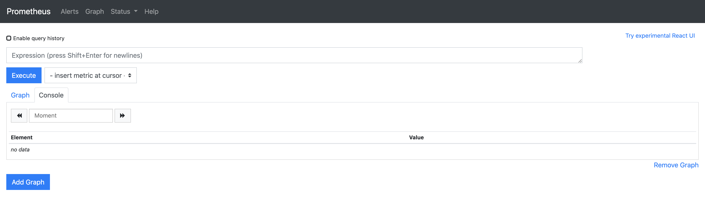

## Scenario 20 - Horizontal Pod Auto-Scaling with Custom-Metrics

- This scenario describes how to auto-scale backend or managed API horizontally based on custom metrics.
- Prometheus will be used as the monitoring system for custom metrics.
- Metrics for backend and the managed API can be separately configured.
    - In Private Jet mode backend and managed API will scale separately.
    - In Sidecar mode both backend and managed API will scale together.

- First we want to setup the **Prometheus** monitoring system in the kubernetes cluster.
- We will deploy a target endpoint resource containing the information of the backend service. For this sample we use
a target endpoint of mode Private Jet.
- Then we would refer the backend in the swagger file and set the `private jet` mode in the swagger file.
- Later we will deploy the API using the swagger definition.

***Important:***
> Follow the main README and deploy the api-operator and configuration files.
> Make sure to set the analyticsEnabled to "true" and deploy analytics secret with credentials to analytics server and
> certificate, if you want to check analytics.

### 1. Prerequisites
 
#### 1.1. Kubernetes Metrics Server

[Metrics Server](https://github.com/kubernetes-sigs/metrics-server) collects resource metrics from Kubelets and exposes
them in Kubernetes apiserver through [Metrics API](https://github.com/kubernetes/metrics)
for use by Horizontal Pod Autoscaler and Vertical Pod Autoscaler

- Install Metrics Server

    **NOTE:** This installation only required in local setup, if you using GKE, EKS cluster you do not need to install
    following.
    ```sh
    >> apictl apply -f metrics-server/metrics-server-components-0.3.6.yaml
  
    Output:
    clusterrole.rbac.authorization.k8s.io/system:aggregated-metrics-reader created
    clusterrolebinding.rbac.authorization.k8s.io/metrics-server:system:auth-delegator created
    rolebinding.rbac.authorization.k8s.io/metrics-server-auth-reader created
    apiservice.apiregistration.k8s.io/v1beta1.metrics.k8s.io created
    serviceaccount/metrics-server created
    deployment.apps/metrics-server created
    service/metrics-server created
    clusterrole.rbac.authorization.k8s.io/system:metrics-server created
    clusterrolebinding.rbac.authorization.k8s.io/system:metrics-server created
    ```

#### 1.2. Prometheus Monitoring System

First, we needs to install **Prometheus** monitoring system in the kubernetes cluster.
Lets use the [Prometheus Operator](https://github.com/coreos/prometheus-operator/tree/v0.39.0) for this installation.

- Install Prometheus Operator (version 0.39 for this sample) in Kubernetes cluster.

    ```sh
    >> apictl apply -f https://raw.githubusercontent.com/coreos/prometheus-operator/v0.39.0/bundle.yaml
  
    Output:
    customresourcedefinition.apiextensions.k8s.io/alertmanagers.monitoring.coreos.com created
    customresourcedefinition.apiextensions.k8s.io/podmonitors.monitoring.coreos.com created
    customresourcedefinition.apiextensions.k8s.io/prometheuses.monitoring.coreos.com created
    customresourcedefinition.apiextensions.k8s.io/prometheusrules.monitoring.coreos.com created
    customresourcedefinition.apiextensions.k8s.io/servicemonitors.monitoring.coreos.com created
    customresourcedefinition.apiextensions.k8s.io/thanosrulers.monitoring.coreos.com created
    clusterrolebinding.rbac.authorization.k8s.io/prometheus-operator created
    clusterrole.rbac.authorization.k8s.io/prometheus-operator created
    deployment.apps/prometheus-operator created
    serviceaccount/prometheus-operator created
    service/prometheus-operator created
    ```

- Create a Prometheus instance in Kubernetes cluster. The directory `prometheus/` contains related configurations.
    ```sh
    >> apictl apply -f prometheus/
  
    Output:
    prometheus.monitoring.coreos.com/prometheus created
    serviceaccount/prometheus created
    clusterrole.rbac.authorization.k8s.io/prometheus created
    clusterrolebinding.rbac.authorization.k8s.io/prometheus created
    servicemonitor.monitoring.coreos.com/products created
    service/prometheus created
    ```
  
  In this sample we have defined the endpoint ports as `metrics` and `products` for metrics in the file
  [service-monitor.yaml](prometheus/service-monitor.yaml). Name of the metrics port of **micro-gateway** is `metrics`.
  Make sure to add `metrics` as the port of **micro-gateway** when you are working on your samples.
    ```yaml
    kind: ServiceMonitor
    spec:
      endpoints:
      - port: metrics
      - port: products
    ```
  
- Test the Prometheus deployment by visiting the url `http://<NODE-IP>:30900/graph`.
    

#### 1.3. Prometheus Adapter

- Create namespace `custom-metrics`.
    ```sh
    >> kubectl create namespace custom-metrics
  
    Output:
    namespace/custom-metrics created
    ```
- Create service certificate. Follow [Serving Certificates, Authentication, and Authorization](https://github.com/kubernetes-sigs/apiserver-builder-alpha/blob/v1.18.0/docs/concepts/auth.md)
to create serving certificate. For this sample we can use certs in the directory `prometheus-adapter/certs`. Create secret `cm-adapter-serving-certs` as follows.
    ```sh
    >> kubectl create secret generic cm-adapter-serving-certs \
            --from-file=serving-ca.crt=prometheus-adapter/certs/serving-ca.crt \
            --from-file=serving-ca.key=prometheus-adapter/certs/serving-ca.key \
            -n custom-metrics
    
    Output:
    secret/cm-adapter-serving-certs created
    ```

- Install Prometheus Adapter (version 0.7.0 for this sample) in Kubernetes cluster.
    ```sh
    >> apictl apply -f prometheus-adapter/
  
    Output:
    clusterrolebinding.rbac.authorization.k8s.io/custom-metrics:system:auth-delegator created
    rolebinding.rbac.authorization.k8s.io/custom-metrics-auth-reader created
    deployment.apps/custom-metrics-apiserver created
    clusterrolebinding.rbac.authorization.k8s.io/custom-metrics-resource-reader created
    serviceaccount/custom-metrics-apiserver created
    service/custom-metrics-apiserver created
    apiservice.apiregistration.k8s.io/v1beta1.custom.metrics.k8s.io created
    clusterrole.rbac.authorization.k8s.io/custom-metrics-server-resources created
    configmap/adapter-config created
    clusterrole.rbac.authorization.k8s.io/custom-metrics-resource-reader created
    clusterrolebinding.rbac.authorization.k8s.io/hpa-controller-custom-metrics created
    ```
  In the directory `prometheus-adapter` we have specified configurations for Prometheus Adapter.
  [custom-metrics-config-map.yaml](prometheus-adapter/custom-metrics-config-map.yaml) contains rules defined for this
  sample.
    ```yaml
    # rule for products backend service
    - seriesQuery: '{__name__=~"^.*_http_requests_total"}'
      resources:
        overrides:
          namespace: {resource: "namespace"}
          pod: {resource: "pod"}
      name:
        matches: "^(.*)_http_requests_total"
        as: "${1}_http_requests_total_per_second"
      metricsQuery: 'sum(rate(<<.Series>>{<<.LabelMatchers>>,http_url!=""}[1m])) by (<<.GroupBy>>)'
    
    # rule for managed API (micro-gateway)
    - seriesQuery: '{__name__="http_requests_total_value"}'
      resources:
        overrides:
          namespace: {resource: "namespace"}
          pod: {resource: "pod"}
      name:
        matches: "http_requests_total_value"
        as: "http_requests_total_value_per_second"
      metricsQuery: 'sum(rate(<<.Series>>{<<.LabelMatchers>>,http_url!~"(/health|/metrics)"}[1m])) by (<<.GroupBy>>)'
    ```

- Test the Prometheus Adapter deployment executing follows.
    ```sh
    >> kubectl get --raw /apis/custom.metrics.k8s.io/v1beta1
  
    Output:
    {"kind":"APIResourceList","apiVersion":"v1","groupVersion":"custom.metrics.k8s.io/v1beta1","resources":[]}
    ```

### 2. Go Through Sample

#### 2.1. Configure Metrics

- For this sample let's make our custom metrics as follows.
    - Managed API: 0.2 http requests per second (i.e. 1 http request per 5 seconds)
    
      `http_requests_total_value_per_second = 200m`
      
    - Target Endpoint: 0.1 http requests per second (i.e. 1 http request per 10 seconds)
    
      `products_http_requests_total_per_second = 100m`

- Update the configmap `hpa-configs` with metrics by editing the file `controller-configs/controller_conf.yaml` in
distribution as follows.
    ```yaml
    apiVersion: v1
    kind: ConfigMap
    metadata:
      name: hpa-configs
      namespace: wso2-system
    data:
      # Horizontal Pod Auto-Scaling for Micro-Gateways
      # Maximum number of replicas for the Horizontal Pod Auto-scale. Default->  maxReplicas: "5"
      mgwMaxReplicas: "5"
      # Metrics configurations
      mgwMetrics: |
        - type: Resource
          resource:
            name: cpu
            target:
                type: Utilization
                averageUtilization: 50
         - type: Pods
           pods:
             metric:
                 name: http_requests_total_value_per_second
             target:
                 type: AverageValue
                 averageValue: 200m
    
      # Horizontal Pod Auto-Scaling for Target-Endpoints
      # Maximum number of replicas for the Horizontal Pod Auto-scale. Default->  maxReplicas: "5"
      targetEndpointMaxReplicas: "5"
      # Metrics configurations
      targetEndpointMetrics: |
        - type: Resource
          resource:
            name: cpu
            target:
                type: Utilization
                averageUtilization: 50
        - type: Pods
          pods:
            metric:
                name: products_http_requests_total_per_second
            target:
                type: AverageValue
                averageValue: 100m
    ```
    
    ```sh
    >> apictl apply -f controller-configs/controller_conf.yaml
    ```

#### 2.2. Deploy sample

- Navigate to `scenarios/scenario-20` directory and deploy the sample backend service using the following command.
    ```sh
    >> apictl apply -f products-privatejet.yaml
    
    Output:
    targetendpoint.wso2.com/products-privatejet created
    ```
- Basic swagger definition belongs to the "products" service is available in swagger.yaml.
Backend endpoint of the API should be mentioned in the swagger file with the "x-wso2-production-endpoints" extension.
The mode of managed API (private jet or sidecar) also has to be mentioned in the swagger with the "x-wso2-mode" extension.
In this swagger definition, the backend service of the "products" service and the managed API mode have been mentioned as follows.
    ```yaml
    x-wso2-production-endpoints: products-privatejet
    x-wso2-mode: privateJet
    ```

- Create API
    ```sh
    >> apictl add api -n products-pj --from-file=swagger.yaml --override

    Output:
    creating configmap with swagger definition
    configmap/products-pj-swagger created
    api.wso2.com/products-pj created
    ```
  
  **Note:** When you use the --override flag, it builds the docker image and pushes to the docker registry although it is available in the docker registry. If you are using AWS ECR as the registry type, delete the image of the API.
    
- Get available API
    ```sh
    >> apictl get apis

    Output:   
    NAME          AGE
    products-pj   3m
    ```

#### 2.3. Test Sample

- Get service details to invoke the API
    ```sh
    >> apictl get services

    Output:
    NAME                  TYPE           CLUSTER-IP      EXTERNAL-IP   PORT(S)                         AGE
    products-pj           LoadBalancer   10.99.134.132   <pending>     9095:32290/TCP,9090:30057/TCP   1s
    products-privatejet   ClusterIP      10.101.34.213   <none>        80/TCP                          45m
    ```
    - You can see both the backend(products-privatejet) service and the managed API service(product-pj) is available.
    - Get the external IP of the managed API's service.
 
- List the pods and check how the backend services and the managed API have been deployed

    ```sh
    >> apictl get pods        

    Output:
    products-pj-699d65df7f-qt2vv           1/1     Running   0          5m12s
    products-privatejet-6777d6f5bc-gqfg4   1/1     Running   0          25m
    products-privatejet-6777d6f5bc-k88sl   1/1     Running   0          25m
    ```

- Invoking the API
    ```sh
    TOKEN=eyJ0eXAiOiJKV1QiLCJhbGciOiJSUzI1NiIsIng1dCI6Ik5UZG1aak00WkRrM05qWTBZemM1TW1abU9EZ3dNVEUzTVdZd05ERTVNV1JsWkRnNE56YzRaQT09In0.eyJhdWQiOiJodHRwOlwvXC9vcmcud3NvMi5hcGltZ3RcL2dhdGV3YXkiLCJzdWIiOiJhZG1pbkBjYXJib24uc3VwZXIiLCJhcHBsaWNhdGlvbiI6eyJvd25lciI6ImFkbWluIiwidGllciI6IjEwUGVyTWluIiwibmFtZSI6InNhbXBsZS1jcmQtYXBwbGljYXRpb24iLCJpZCI6NCwidXVpZCI6bnVsbH0sInNjb3BlIjoiYW1fYXBwbGljYXRpb25fc2NvcGUgZGVmYXVsdCIsImlzcyI6Imh0dHBzOlwvXC93c28yYXBpbTozMjAwMVwvb2F1dGgyXC90b2tlbiIsInRpZXJJbmZvIjp7fSwia2V5dHlwZSI6IlBST0RVQ1RJT04iLCJzdWJzY3JpYmVkQVBJcyI6W10sImNvbnN1bWVyS2V5IjoieF8xal83MW11dXZCb01SRjFLZnVLdThNOVVRYSIsImV4cCI6MzczMTQ5Mjg2MSwiaWF0IjoxNTg0MDA5MjE0LCJqdGkiOiJkYTA5Mjg2Yy03OGEzLTQ4YjgtYmFiNy1hYWZiYzhiMTUxNTQifQ.MKmGDwh855NrZ2wOvXO7TwFbCtsgsOFuoZW4DBVIbJ1KQ2F6TgTgBbtzBUvrYGPslEExMemhepfvvlYv8Gd6MMo3GVH4aO8AKyc8gHmeIQ8MQtXGn7u9N00ZW3_9JWaQkU-OYEDsLHvKKHzO0t2umaskSyCS2UkAS4wIT_szZ5sm-O-ez4nKGeJmESiV-1EchFjOhLpEH4p9wIj3MlKnZrIcJByRKK9ZGaHBqxwwYuJtMCDNa2wFAPMOh-45eabIUdo1KUO3gZLVcME93aza1t1jzL9mFsx0LGaXIxB7klrDuBCAdG9Yi3O7-3WUF74QaS2tmCxW36JhhOJ5DdacfQ
    ```
   
    ```sh
    >> curl -X GET "https://<EXTERNAL_IP_OF_LB_SERVICE>:9095/prodapi/v1/products" -H "Authorization:Bearer $TOKEN" -k

    Output:
    [{"productId":101,"name":"Apples","category":"Food","price":1.49},
    {"productId":102,"name":"Macaroni & Cheese","category":"Food","price":7.69},
    {"productId":102,"name":"ABC Smart TV","category":"Electronics","price":399.99},
    {"productId":104,"name":"Motor Oil","category":"Automobile","price":22.88},
    {"productId":105,"name":"Floral Sleeveless Blouse","category":"Clothing","price":21.5}]
    ```

- Test HPA
    Lets make `IP` as the external IP of the LB service and `PERIOD` as waiting period in seconds to send requests
    periodically.
    ```sh
    >> TOKEN=eyJ0eXAiOiJKV1QiLCJhbGciOiJSUzI1NiIsIng1dCI6Ik5UZG1aak00WkRrM05qWTBZemM1TW1abU9EZ3dNVEUzTVdZd05ERTVNV1JsWkRnNE56YzRaQT09In0.eyJhdWQiOiJodHRwOlwvXC9vcmcud3NvMi5hcGltZ3RcL2dhdGV3YXkiLCJzdWIiOiJhZG1pbkBjYXJib24uc3VwZXIiLCJhcHBsaWNhdGlvbiI6eyJvd25lciI6ImFkbWluIiwidGllciI6IjEwUGVyTWluIiwibmFtZSI6InNhbXBsZS1jcmQtYXBwbGljYXRpb24iLCJpZCI6NCwidXVpZCI6bnVsbH0sInNjb3BlIjoiYW1fYXBwbGljYXRpb25fc2NvcGUgZGVmYXVsdCIsImlzcyI6Imh0dHBzOlwvXC93c28yYXBpbTozMjAwMVwvb2F1dGgyXC90b2tlbiIsInRpZXJJbmZvIjp7fSwia2V5dHlwZSI6IlBST0RVQ1RJT04iLCJzdWJzY3JpYmVkQVBJcyI6W10sImNvbnN1bWVyS2V5IjoieF8xal83MW11dXZCb01SRjFLZnVLdThNOVVRYSIsImV4cCI6MzczMTQ5Mjg2MSwiaWF0IjoxNTg0MDA5MjE0LCJqdGkiOiJkYTA5Mjg2Yy03OGEzLTQ4YjgtYmFiNy1hYWZiYzhiMTUxNTQifQ.MKmGDwh855NrZ2wOvXO7TwFbCtsgsOFuoZW4DBVIbJ1KQ2F6TgTgBbtzBUvrYGPslEExMemhepfvvlYv8Gd6MMo3GVH4aO8AKyc8gHmeIQ8MQtXGn7u9N00ZW3_9JWaQkU-OYEDsLHvKKHzO0t2umaskSyCS2UkAS4wIT_szZ5sm-O-ez4nKGeJmESiV-1EchFjOhLpEH4p9wIj3MlKnZrIcJByRKK9ZGaHBqxwwYuJtMCDNa2wFAPMOh-45eabIUdo1KUO3gZLVcME93aza1t1jzL9mFsx0LGaXIxB7klrDuBCAdG9Yi3O7-3WUF74QaS2tmCxW36JhhOJ5DdacfQ
    IP=<EXTERNAL_IP_OF_LB_SERVICE>
    PERIOD=5
    ```
    Send requests periodically.
    ```sh
    >> echo "Start sending requests"
    i=1
    while true; do
      printf "\nREQUST: %s and SLEEP %s seconds ------------------------------------------------\n" ${i} ${PERIOD};
      i=$((i+1)) ;
      curl -X GET "https://${IP}:9095/prodapi/v1/products" -H "Authorization:Bearer $TOKEN" -k & sleep ${PERIOD};
    done
    ```
    Open a new terminal and execute following to get HPA details
    ```sh
    >> apictl get hpa;
  
    Output:
    
    ```

### 3. Cleanup

- Delete the API and the sample backend service (Target Endpoint resource)
    ```
    >> apictl delete api products-pj
    >> apictl delete targetendpoints products-privatejet

    Output:
    api.wso2.com "products-pj" deleted
    targetendpoint.wso2.com "products-privatejet" deleted
    ```

### 4. References

- Horizontal Pod Autoscale: https://kubernetes.io/docs/tasks/run-application/horizontal-pod-autoscale/
- Metrics Server: https://github.com/kubernetes-sigs/metrics-server
- Prometheus Operator: https://github.com/coreos/prometheus-operator/tree/v0.39.0
- Prometheus Adapter: https://github.com/DirectXMan12/k8s-prometheus-adapter/tree/v0.7.0
- Serving Certificate: https://github.com/kubernetes-sigs/apiserver-builder-alpha/blob/master/docs/concepts/auth.md
- Sample backend with metrics: https://hub.docker.com/repository/docker/renukafernando/k8s-prometheu-metrics-sample